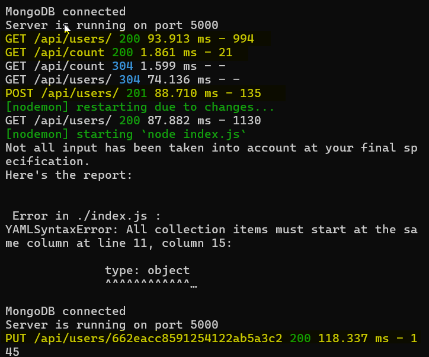

# <a href="https://data-neuron-task-dtpiny8uk-prabhatchanchals-projects.vercel.app/" style="background-color: #1a73e8; color: white; font-weight: bold; padding: 10px 20px; border-radius: 5px; text-decoration: none" target="\_blank" >Task 1</a>

### Deployed on varce : <a href="https://data-neuron-task-dtpiny8uk-prabhatchanchals-projects.vercel.app/" style="background-color: #1a73e8; color: white; font-weight: bold; padding: 10px 20px; border-radius: 5px; text-decoration: none;" target="_blank">DataNeuronTask</a>

This is the source code of the task2: <a href="https://github.com/prabhatchanchal/DataNeuronTask" style="background-color: #1a73e8; color: white; font-weight: bold; padding: 10px 20px; border-radius: 5px; text-decoration: none;">DataNeuronTask</a>

  

  <h1 style="font-size: 2rem; font-weight: bold; margin-bottom: 10px;">About</h1>
  
Hi there! I'm Prabhat, a Full Stack developer with over a 1.8 years of experience. 
  

  

  

  Task 2:- Create APIs for the frontend part you have created in
    ReactJs.
    1. API to add/edit data in these components:
    There should be 2 button:-
        ● Add: On clicking the Add button, if there is any data it should get clear and the user should be able to add new data. (it will create new entry in table) ● Update: On this button click, the user should be able to update the data. (it will update entry in table) ● Count: API to show number of times (count), user has called add and update API

Things to consider:-

1. Must deploy both the tasks and share the link along with the submission
2. Clean code, with proper commenting
3. Mention the execution time for each API
4. Provide the table/collection for database
5. Provide basic validations, if needed
6. Can use any database

  <h1 style="font-size: 2rem; font-weight: bold; margin-bottom: 10px;">Tech Stack</h1>
  <ul>
    <li>HTML</li>
    <li>CSS</li>
    <li>JavaScript</li>
    <li>JQuery</li>
  </ul>

  <h1>Here is execution time of api</h1>
  

    

